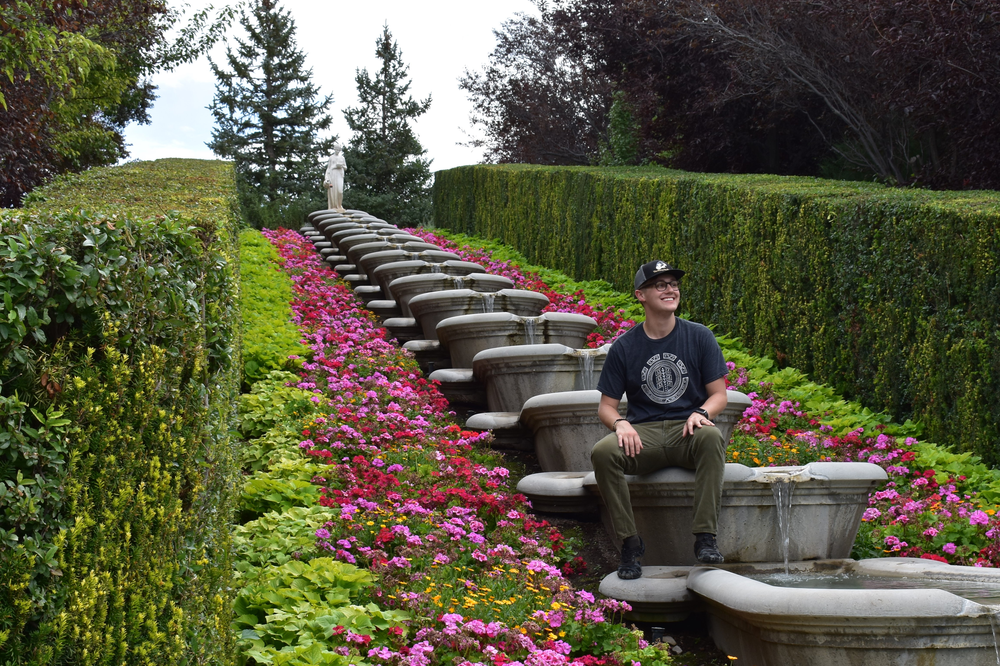
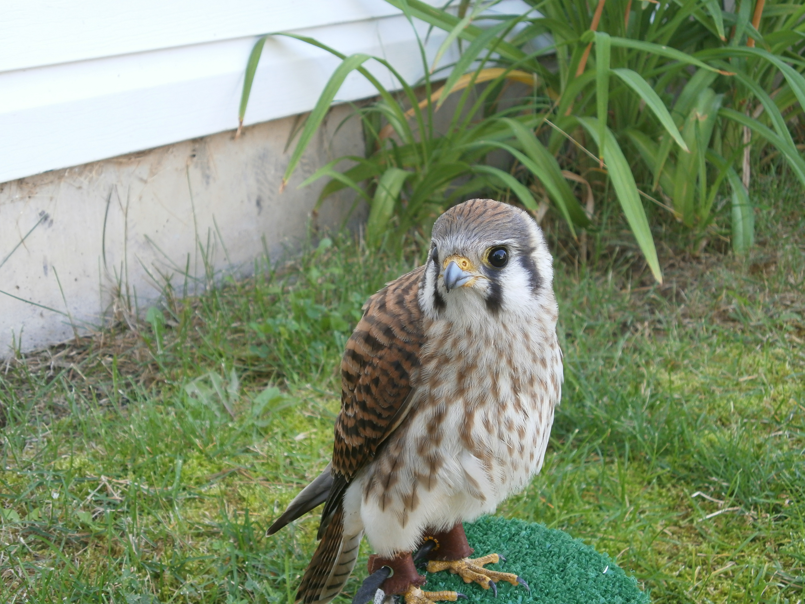

<style type="text/css">
.main-container {
  max-width: 1800px;
  margin-left: auto;
  margin-right: auto;
}
</style>

<style>
div.gray { background-color:#1f68cf; border-radius: 5px; padding: 20px;}
</style>
<div class = "gray">


<style>
div.blue { background-color:#cfc5ab; border-radius: 5px; padding: 20px;}
</style>
<div class = "blue">

## [Home](http://falconer94.github.io/) | [About Me](http://falconer94.github.io/About_Me/) | [Project](https://falconer94.github.io/Project) | [Exam 3](https://falconer94.github.io/Exam_3)


# About Me

```{r, echo=FALSE,out.width= "600px"}

```
<br><br>
I grew up in Northern Idaho near Spokane, WA, served a Spanish-speaking mission for my church in LA, married for four years, and almost have my bachelor's in biology from UVU.
<br><br>
I love learning new things, so I have a lot of hobbies. Some of my favorites (which I may not be currently participating in) are falconry, pets, music, and reading/writing sci-fi and fantasy. 
<br><br>
```{r, echo=FALSE,out.height= "200px"}

knitr::include_graphics("Pics/Indy on couch (26).JPG")
```
<br><br>
My mental health has been a challenge for me for the last several years, but it has shaped me into a better person. 

